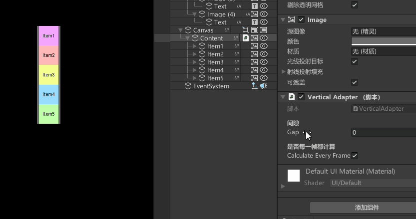
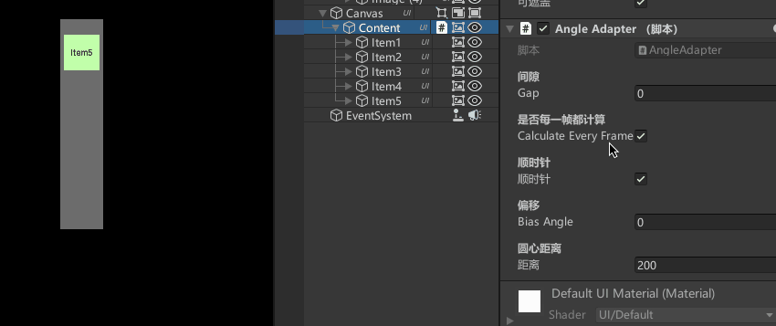
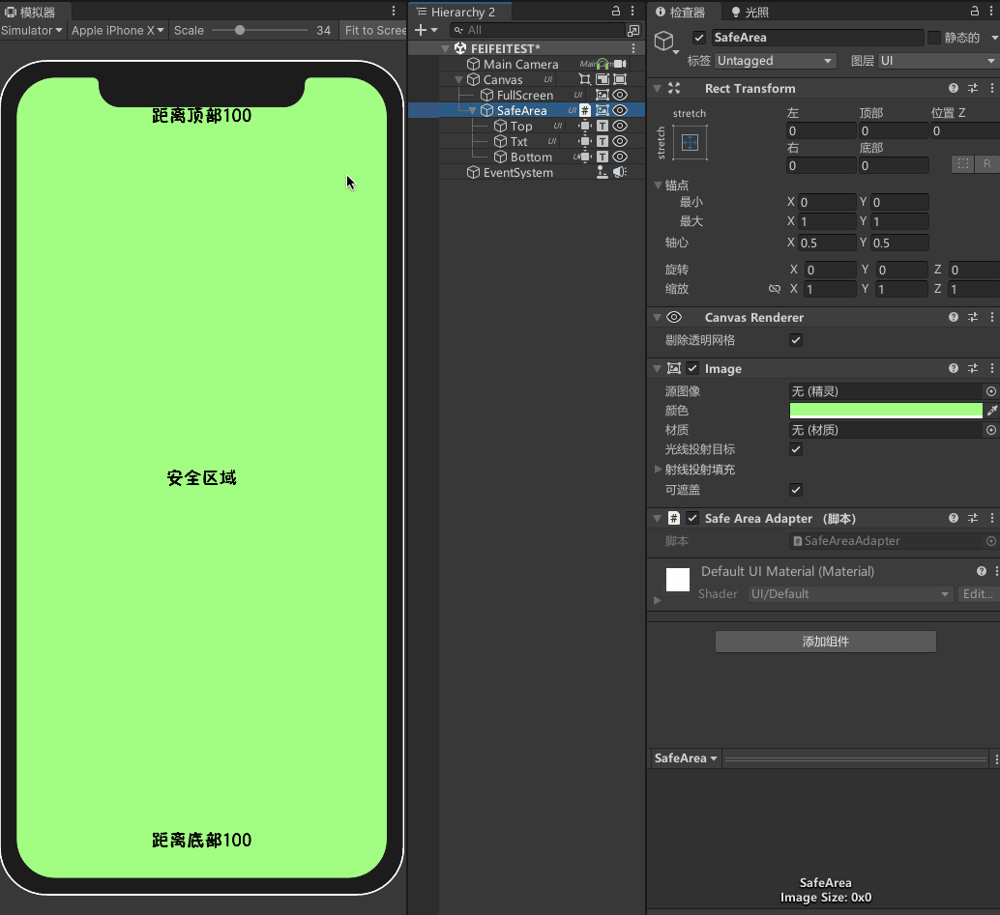

# 特点
```
(1) 简单易用，挂载脚本后无需其他操作。  
(2) 编辑器下可实时查看效果。  
```

# 如何使用
## 垂直适配器  
在Items的父物体挂载`VerticalAdapter`脚本，Items的X轴坐标将被控制，Y轴坐标不受影响。  
动态添加或删除元素，会自动适配，如果关闭每帧计算，需要手动调用适配方法。  
 
## 水平适配器  
在Items的父物体挂载`HorizontalAdapter`脚本，Items的Y轴坐标将被控制，X轴坐标不受影响。    
动态添加或删除元素，会自动适配，如果关闭每帧计算，需要手动调用适配方法。  
  
## 角度适配器  
在Items的父物体挂载`AngleAdapter`脚本，Items的X轴坐标、Y轴坐标和旋转将被控制。  
动态添加或删除元素，会自动适配，如果关闭每帧计算，需要手动调用适配方法。 
  
## 安全区域适配器  
在UI面板上挂载`SafeAreaAdapter`脚本，UI面板显示时会自动适配异形屏。  
`SafeAreaAdapter`在使用时需要进行初始化。  
```C#
CanvasScaler scaler;
SafeAreaAdapter.Init(scaler);
```
  